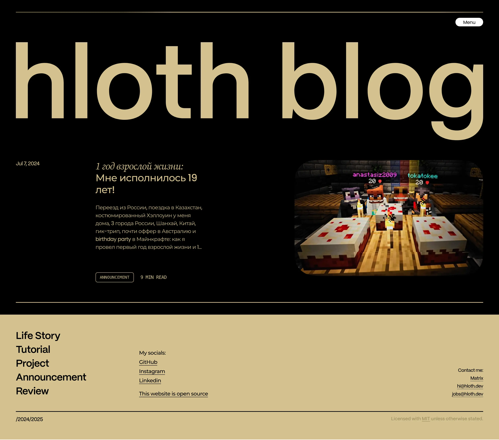

# [hloth blog](https://blog.hloth.dev)

[Visit the website](https://blog.hloth.dev) • Visit in Tor network: [blog.hlothdevzkti6suoksy7lcy7hmpxnr3msu5waokzaslsi2mnx5ouu4qd.onion](http://blog.hlothdevzkti6suoksy7lcy7hmpxnr3msu5waokzaslsi2mnx5ouu4qd.onion/)

My personal blog about web development stuff and my IRL stuff. No ads, no JavaScript required, pure shitpost 😻

Old React v18 + Next.js v14 version is available under [react18-nextjs14-2024](https://github.com/VityaSchel/blog.hloth.dev/tree/react18-nextjs14-2024) branch.

## Donate

[hloth.dev/donate](https://hloth.dev/donate) · Tor: [hlothdevzkti6suoksy7lcy7hmpxnr3msu5waokzaslsi2mnx5ouu4qd.onion/donate](http://hlothdevzkti6suoksy7lcy7hmpxnr3msu5waokzaslsi2mnx5ouu4qd.onion/donate)

## Acknowledgements

- Design inspired by Milos Bojkovic. [Dribbble project link](https://dribbble.com/shots/21592801-Blog-post-exploration).
- PP Mori font by Pangram Pangram Foundry (free for personal use). [License](./static/pp-mori/license.pdf).
- Visual post editor by @editorjs authors.
- [Svelte & SvelteKit](https://svelte.dev/) ❤️
- A special THANK YOU to [Anthony Fu](https://antfu.me/) for fantastic [shiki](https://github.com/shikijs/shiki) code highlighter!

## License

Source code is licensed under [MIT](./LICENSE). Blog materials are licensed under [CC BY 4.0](https://creativecommons.org/licenses/by/4.0/) unless otherwise stated.
